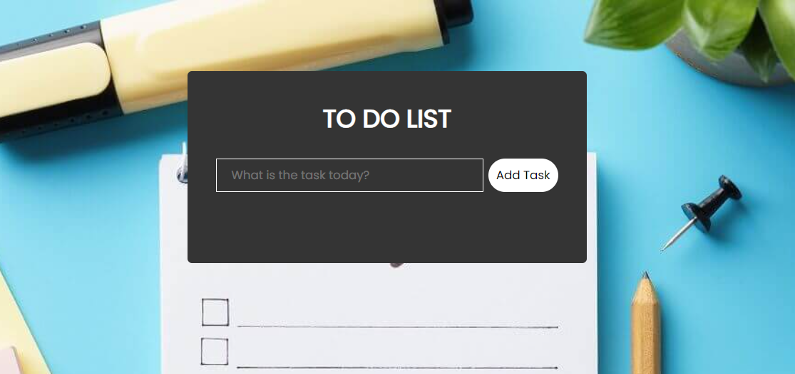
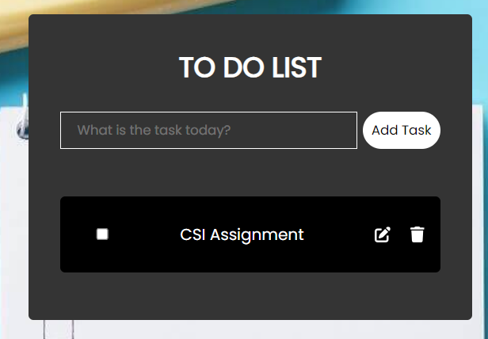
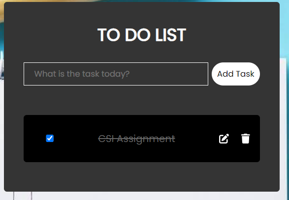

# TODO-LIST
### Steps to test TODO-LIST are:
- clone the github repository on your local machine by running the following command: `git clone <url>`
   - url can be get from github repository by clicking the Code button and copying the https url
- run the following command after cloning the repository: `npm i` to install all the dependencies 
- after installing the dependencies run the following command to start the application: `npm start`
- now you can create, update and delete the tasks and can use TODO-LIST to test its functionality.

- TODO LIST image

- Add a new task
   - create a new task by writing the task in input box and clicking the Add task button.
   - 

- Complete the task
   - Tap on the completed task and click the check-box to mark the task completed successfully.
   - 

- Remove the task
   - After the task has been completed click on the delete icon to remove the task from the list of tasks.

- Update the task
   - if you want to update the task then click on update icon and update the task and click the update button to update the task accordingly.
